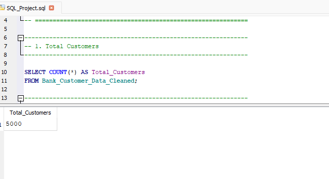
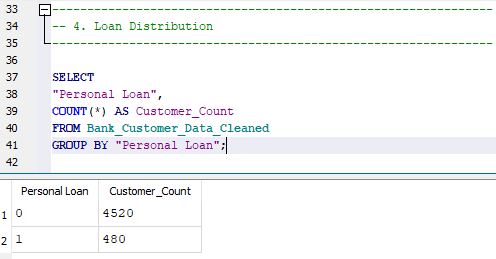
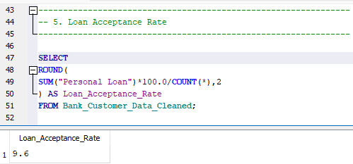
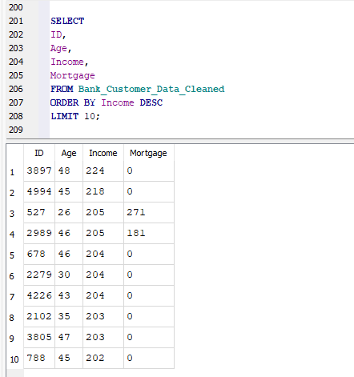

# 🏦 Bank Customer Data Analysis using SQL

## 📌 Project Overview

This project analyzes a banking customer dataset using SQL to uncover customer demographics, financial behavior, and factors influencing personal loan acceptance. The analysis demonstrates practical SQL skills for business reporting, customer segmentation, and data-driven decision-making.

---

## 🎯 Business Objective

The objective of this project is to answer key business questions such as:

- Who are the bank's customers?
- Which customers are more likely to accept a personal loan?
- How do income, education, and mortgage influence loan acceptance?
- What banking services are most commonly used?
- How can customer segmentation support business decisions?

---

## 📂 Dataset

- **Dataset:** Bank Personal Loan Modelling
- **Records:** 5,000 customers
- **Database:** SQLite
- **File Format:** CSV

---

## 🛠️ Tools & Technologies

- SQL (SQLite)
- DB Browser for SQLite
- Microsoft Excel (Data Cleaning)
- Git & GitHub

---

## 📊 SQL Concepts Demonstrated

- SELECT
- WHERE
- ORDER BY
- GROUP BY
- Aggregate Functions
- CASE Statements
- Subqueries
- Filtering
- Customer Segmentation
- Business KPI Analysis

- ---

## 📁 Project Structure

```text
bank-customer-data-analysis-sql
│
├── Database
│   └── Bank_Customer_Analysis.db
│
├── Screenshots
│   ├── 01_total_customers.png
│   ├── 02_loan_distribution.png
│   ├── 03_loan_acceptance_rate.png
│   ├── 04_customers_by_education.png
│   ├── 05_average_income_by_loan_status.png
│   ├── 06_online_banking_usage.png
│   ├── 07_top_10_highest_income_customers.png
│   └── 08_customers_above_average_income.png
│
├── data
│   ├── Bank_Personal_Loan_Modelling.csv
│   └── Bank_Customer_Data_Cleaned.csv
│
├── analysis_queries.sql
│
└── README.md
```
---

## ❓ Business Questions Answered

This analysis addresses several business questions, including:

- What is the total customer base?
- What percentage of customers accepted a personal loan?
- How does customer income influence loan acceptance?
- Which education groups have the highest loan acceptance?
- How are customers distributed across family sizes?
- How widely are online banking and credit cards used?
- Which customers have above-average income or mortgage values?
- How can customers be segmented into income groups?

---

## 📈 Key Insights

- Analyzed **5,000 customer records** to understand banking behavior.
- Calculated the **personal loan acceptance rate** to evaluate campaign effectiveness.
- Identified relationships between **income, education, and loan acceptance**.
- Segmented customers into **low-, medium-, and high-income groups** using SQL.
- Compared customer financial characteristics using aggregate analysis and subqueries.
- Evaluated adoption of banking services such as **online banking, credit cards, securities accounts, and CD accounts**.

---

## 💻 SQL Techniques Used

- Data Filtering (`WHERE`)
- Sorting (`ORDER BY`)
- Grouping (`GROUP BY`)
- Aggregate Functions (`COUNT`, `SUM`, `AVG`, `MIN`, `MAX`)
- Conditional Logic (`CASE`)
- Subqueries
- Aliases
- Business KPI Calculations

## 📷 Project Screenshots

### Customer & Loan Analysis

> **Total Customers**
>
> Displays the total number of customer records available for analysis.



---

> **Loan Distribution**
>
> Compares customers who accepted and did not accept a personal loan.



---

> **Loan Acceptance Rate**
>
> Calculates the percentage of customers who accepted the bank's personal loan offer.



---

> **Top Income Customers**
>
> Lists the highest-income customers to support customer segmentation.



---

## ▶️ How to Run This Project

1. Clone this repository.
2. Open the database using **DB Browser for SQLite**.
3. Load the database file from the `database` folder.
4. Open the SQL script located in the `sql` folder.
5. Execute the queries individually or run the complete SQL script.

---

## 🚀 Future Improvements

- Build an interactive Power BI dashboard using the same dataset.
- Perform predictive analysis using Python and machine learning.
- Design a relational database with multiple linked tables.
- Optimize SQL queries for larger datasets.
- Create stored procedures and views using MySQL or PostgreSQL.

---

## 👩‍💻 Author

**Geethu G**

M.Sc. Physics | Data Analytics Enthusiast

**Skills:** SQL • Python • Excel • Power BI • Data Analysis
